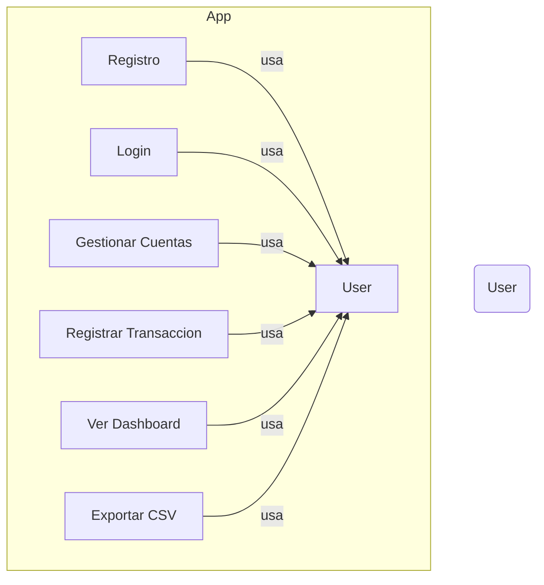
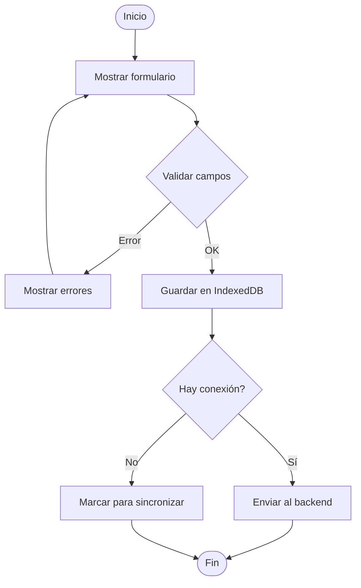

# Finance App — Frontend (Vue 3 + TypeScript + Vite)

Frontend de la aplicación de finanzas construido con Vue 3, TypeScript y Vite. Esta carpeta contiene la interfaz web que se conecta a Supabase para autenticación y persistencia de datos (transacciones, balances, usuarios).

Características principales
- Registro e inicio de sesión con Supabase
- Crear, listar y eliminar transacciones
- Visualización de balance y resumen de gastos
- UI basada en PrimeVue (componentes y estilos)

Tecnologías
- Vue 3 + Composition API
- TypeScript
- Vite (dev server y build)
- Supabase (auth + base de datos)
- PrimeVue, PrimeFlex

Requisitos
- Node.js 18+ (recomendado)
- npm, yarn o pnpm

## Instalación rápida
1. Clona el repositorio y entra en la carpeta frontend:

```bash
git clone <repo-url>
cd finance-front
```

2. Instala dependencias:

```bash
npm install
# o yarn
yarn
# o pnpm
pnpm install
```

## Configuración (Supabase)
1. Crea un proyecto en Supabase y copia:
	- URL del proyecto (Supabase URL)
	- Anon public key (ANON KEY)

2. Crea un archivo `.env` o `.env.local` en la raíz del frontend con estas variables:

```text
VITE_SUPABASE_URL=your-supabase-url
VITE_SUPABASE_ANON_KEY=your-anon-key
```

Nota: Vite expone variables que comienzan con `VITE_` al cliente. No incluyas claves sensibles de servicio en el frontend.

## Scripts disponibles
- `npm run dev` — Inicia el servidor de desarrollo (Vite).
- `npm run build` — Compila la aplicación para producción (`vue-tsc -b && vite build`).
- `npm run preview` — Sirve la versión construida localmente para previsualizar.

## Estructura del proyecto (resumen)
- `index.html` — Punto de entrada
- `src/main.ts` — Inicializa Vue y el router
- `src/App.vue` — Componente raíz
- `src/api/supabase.ts` — Cliente de Supabase (configurado desde `VITE_*`)
- `src/views/Home.vue` — Vista de presentacion del proyecto 
- `src/views/Dashboard.vue` — Vista principal con balances y lista de transacciones
- `src/views/Login.vue`, `src/views/Register.vue` — Páginas de autenticación
- `src/components/TransactionForm.vue` — Formulario para añadir transacciones
- `src/components/TransactionList.vue` — Lista y filtrado de transacciones
- `src/components/BalanceCard.vue` — Componente que muestra el balance
- `src/stores/loading.ts` — Estado global de carga

## PWA — Service Worker y manifest
--------------------------------

Este proyecto está configurado como Progressive Web App usando `vite-plugin-pwa`.

- Configuración del plugin PWA: revisá `vite.config.ts` (plugin `VitePWA`). Allí se define el `manifest`, las `icons`, y las reglas de `workbox` (caching, navigateFallback, runtimeCaching, etc.).
- Registro del Service Worker: se realiza en `src/main.ts` mediante `registerSW` (import desde `virtual:pwa-register`). El SW se genera en el build y **no** se registra en `npm run dev`.
- Manifest (web app manifest): el archivo principal de manifiesto está en `public/manifest.webmanifest`. Para personalizar el nombre, iconos o colores, editá ese archivo y los iconos en `public/icons/`.

## Despliegue
- Construye con `npm run build` y despliega los archivos estáticos resultantes en Netlify, Vercel, Surge, o cualquier hosting de archivos estáticos. Asegúrate de configurar las variables de entorno en la plataforma de despliegue (VITE_SUPABASE_URL y VITE_SUPABASE_ANON_KEY).

## Cómo probar localmente

1. Generá la build y servila en modo preview (el Service Worker se registra sólo en la versión construida):

```bash
npm run build
npm run preview
# abrir la URL que muestre el comando (por ejemplo http://localhost:4173)
```

2. Abrí las DevTools del navegador → Application → Service Workers para verificar que el worker esté registrado y en qué estado está.

## Notas útiles

- Para forzar la actualización del SW en desarrollo/depuración: DevTools → Application → Service Workers → "Update" o limpiar "Site data".
- La estrategia de actualización por defecto aquí es `registerType: 'autoUpdate'` (ver `vite.config.ts`), lo que intenta actualizar el SW automáticamente.
- Si necesitás cambiar la política de cache o rutas cached, modificá la sección `workbox` dentro de la configuración PWA en `vite.config.ts`.
- La app también incluye sincronización offline/cola de transacciones mediante `src/api/offline.ts` y `src/utils/idb.ts`. Esta lógica coordina almacenar cambios localmente y sincronizarlos cuando vuelvas online.

## Buenas prácticas
- Usar cuentas y roles de Supabase apropiados. Mantén las reglas RLS (Row Level Security) si necesitas seguridad a nivel de fila.
- No pongas claves privadas en el frontend.

## Requisitos funcionales

- **RF01 - Registro de usuario:** El sistema debe permitir que un usuario se registre usando correo y contraseña, validando formato y contraseña mínima.
- **RF02 - Inicio de sesión:** El usuario debe poder autenticarse con correo y contraseña y mantener sesión hasta cerrar sesión manualmente.
- **RF03 - Gestión de cuentas:** El usuario puede crear, editar y eliminar cuentas (p. ej. Caja, Banco) con saldo inicial.
- **RF04 - Registro de transacciones:** Registrar transacciones de ingreso/gasto con fecha, categoría, monto, descripción y cuenta asociada.
- **RF05 - Listado y filtrado de transacciones:** Mostrar transacciones paginadas y permitir filtrado por fecha, categoría, cuenta y búsqueda por texto.
- **RF06 - Dashboard resumen:** Mostrar saldo total, totales por categoría y gráfico de evolución en el tablero principal.
- **RF07 - Sincronización offline/online:** Permitir operar en modo offline y sincronizar cambios con el backend cuando se recupere la conexión.
- **RF08 - Notificaciones y validaciones:** Mostrar mensajes de éxito/error y validar campos obligatorios en formularios.
- **RF09 - Exportar datos:** Permitir exportar transacciones a CSV.
- **RF10 - Gestión de usuario:** El usuario puede actualizar su perfil y cerrar sesión.

## Criterios de aceptación

Cada requisito funcional cuenta con criterios de aceptación mínimos para validar su cumplimiento:

- **RF01 - Registro de usuario**
	- CA1.1: Formulario con `email`, `password` y `confirm_password`.
	- CA1.2: Validación del formato de correo y contraseña (mínimo 8 caracteres).
	- CA1.3: Al registrarse correctamente, el usuario es redirigido al `Dashboard` y se crea su perfil en la base de datos.

- **RF02 - Inicio de sesión**
	- CA2.1: Formulario con `email` y `password`.
	- CA2.2: Credenciales válidas inician sesión y almacenan token; credenciales inválidas muestran error.
	- CA2.3: Sesión persiste tras recargar la página hasta cerrar sesión.

- **RF03 - Gestión de cuentas**
	- CA3.1: El usuario puede crear una cuenta con `nombre` y `saldo_inicial`.
	- CA3.2: Se puede editar `nombre` y `saldo` y eliminar la cuenta con confirmación.
	- CA3.3: Las operaciones actualizan el balance total mostrado en el `Dashboard`.

- **RF04 - Registro de transacciones**
	- CA4.1: Formulario con `fecha`, `monto`, `categoría`, `cuenta` y `descripcion`.
	- CA4.2: Transacción válida se guarda localmente (si offline) y/o en Supabase (si online).
	- CA4.3: El balance y gráficos se actualizan tras guardar la transacción.

- **RF05 - Listado y filtrado de transacciones**
	- CA5.1: Las transacciones se listan en orden descendente por fecha.
	- CA5.2: Filtros por fecha, categoría y cuenta devuelven resultados correctos.
	- CA5.3: Búsqueda por texto filtra por descripción y categoría.

- **RF06 - Dashboard resumen**
	- CA6.1: Muestra saldo total calculado a partir de cuentas y transacciones.
	- CA6.2: Muestra gráfico de evolución (últimos 30 días) con datos coherentes.
	- CA6.3: Totales por categoría deben sumar al total mostrado.

- **RF07 - Sincronización offline/online**
	- CA7.1: En modo offline, las transacciones se persisten en IndexedDB y la UI permite crear/editar.
	- CA7.2: Al recuperar conexión, los cambios se sincronizan con el backend sin duplicar entradas.
	- CA7.3: Mostrar indicador del estado de sincronización y errores de conflicto.

- **RF08 - Notificaciones y validaciones**
	- CA8.1: Errores de validación muestran mensajes claros y no permiten envío.
	- CA8.2: Acciones exitosas muestran notificación (ej. 'Transacción guardada').

- **RF09 - Exportar datos**
	- CA9.1: Genera un archivo CSV con las transacciones filtradas actualmente.
	- CA9.2: El CSV contiene columnas: fecha, cuenta, categoría, monto, descripción.

- **RF10 - Gestión de usuario**
	- CA10.1: El usuario puede actualizar `nombre` y `email` (validado) desde el perfil.
	- CA10.2: Existe opción para cerrar sesión que elimina el token local.

## Requisitos no funcionales

- **RNF01 - Seguridad:** Autenticación segura, almacenamiento seguro de tokens y transmisión por HTTPS.
- **RNF02 - Rendimiento:** El tiempo de respuesta para listados y acciones CRUD debe ser < 500ms en condiciones normales.
- **RNF03 - Disponibilidad:** La PWA debe funcionar en modo offline para lectura/escritura y sincronizarse posteriormente.
- **RNF04 - Escalabilidad:** La arquitectura debe soportar crecimiento de usuarios y volumen de transacciones sin cambios significativos.
- **RNF05 - Mantenibilidad:** Código modular con separación `components/`, `stores/`, `utils/` y tests unitarios básicos.
- **RNF06 - Usabilidad:** Interfaz clara, accesible y responsiva en móviles y escritorio.
- **RNF07 - Internacionalización:** Preparado para soportar múltiples idiomas (estructura de i18n).
- **RNF08 - Compatibilidad:** Soporte para los navegadores modernos y funcionamiento como PWA.
- **RNF09 - Privacidad:** Cumplimiento con buenas prácticas de protección de datos y posibilidad de eliminar datos de usuario.

## Diagramas

### Diagrama de Casos de Uso



### Diagrama de Arquitectura (alta nivel)

```mermaid
graph LR
  FE[Frontend: Vue 3 + Vite + PWA]
  BE[Backend: Supabase / API REST]
  IDB[IndexedDB (offline)]
  FE -->|Auth/API| BE
  FE -->|Sync| IDB
  IDB -->|Replicación| BE
```

### Diagrama de flujo: Registrar transacción



---

## Contribuir
- Abre un issue describiendo el cambio o el bug.
- Crea una rama con nombre descriptivo: `feature/nombre` o `fix/descripcion`.
- Envía un pull request y describe los cambios realizados.